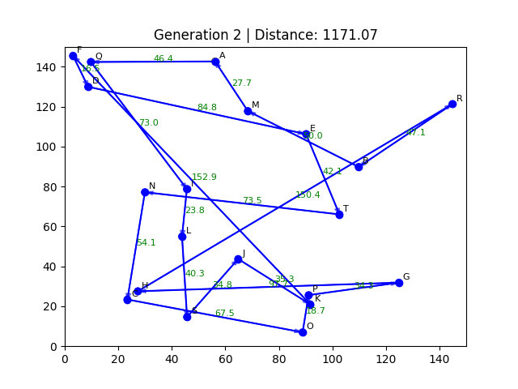

# Travelling Salesman Problem (TSP) with Genetic Algorithm 

This project demonstrates solving the **Travelling Salesman Problem (TSP)** using a **Genetic Algorithm (GA)** with real-time animated visualization in Python.  
The algorithm evolves a population of possible routes to minimize the total travel distance while visiting all cities exactly once and returning to the start.

---

## Features
- Random city generation with labels
- Fixed start city (highlighted in red)
- Genetic Algorithm with:
  - Selection
  - Crossover
  - Mutation
- Animated visualization of route evolution
- Arrows showing direction of travel
- Distance labels on edges
- Saves the animation as a `.gif` for sharing

---

##  Parameters

You can customize the following parameters:

python
NUM_CITIES = 20           # Number of cities in the problem
POP_SIZE = 60             # Population size
GENERATIONS = 150         # Number of generations to evolve
MUTATION_RATE = 0.05      # Mutation rate (0 to 1)
ELITE_SIZE = 1            # Number of elite individuals to carry over

##  Project Structure

## Installation & Setup

### 1. Clone the Repository
git clone https://github.com/<your-username>/<your-repo-name>.git
cd <your-repo-name>

### 2. Create a virtual environment(recommended)
python -m venv venv
source venv/bin/activate    # On Linux/Mac
venv\Scripts\activate       # On Windows

### 3. Install Requirements
pip install -r requirements.txt

### 4. Run the Project
python Travelling_Salesman_Problem_ai_project.py

### 5. Demo output
Here's how the animation looks

